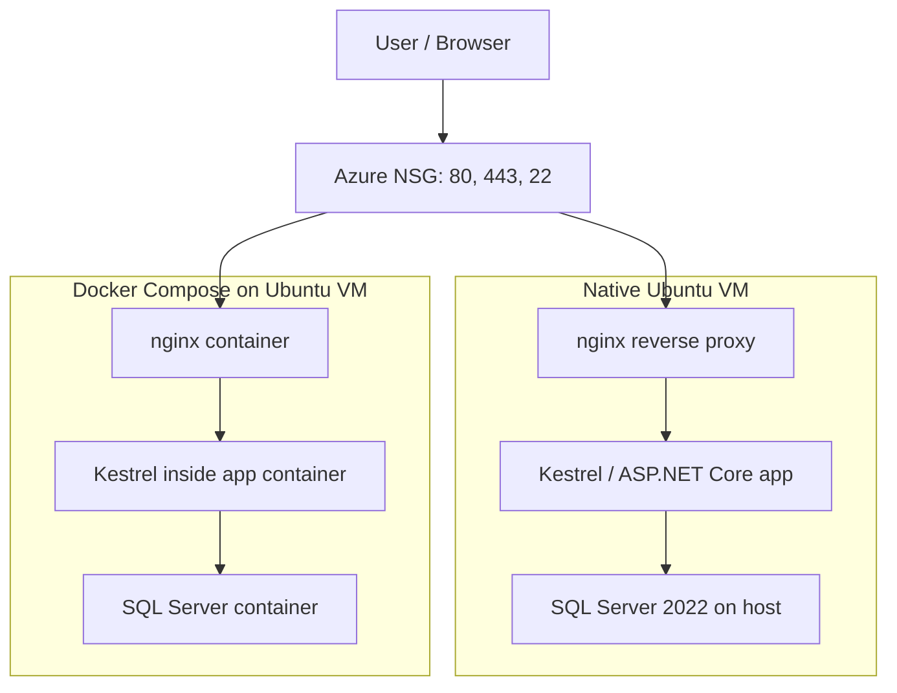

# Azure Ubuntu Deployment Guide: .NET 8 with SQL Server on a Virtual Machine or Docker

This guide shows two supported ways to host a .NET 8 web application with SQL Server on an Ubuntu virtual machine in Azure:

1. Native Ubuntu deployment with `systemd`, `nginx`, and `certbot`.
2. Containerized deployment with Docker Compose, `nginx`, `certbot`, and a SQL Server container.

Use the native path if you want the simplest operational model on a single VM. Use Docker if you want clearer isolation and easier local parity with production.

## Table of Contents

- [What You Will Learn](#what-you-will-learn)
- [Recommended Baseline](#recommended-baseline)
- [Architecture at a Glance](#architecture-at-a-glance)
  - [Request flow and responsibilities](#request-flow-and-responsibilities)
  - [Architecture diagram](#architecture-diagram)
  - [Native VM path](#native-vm-path)
  - [Docker path](#docker-path)
- [Azure VM Setup](#azure-vm-setup)
- [Common Prerequisites](#common-prerequisites)
- [Option 1: Native Ubuntu VM Deployment](#option-1-native-ubuntu-vm-deployment)
  - [1. Install .NET 8 on the VM](#1-install-net-8-on-the-vm)
  - [2. Install SQL Server on Ubuntu](#2-install-sql-server-on-ubuntu)
  - [3. Prepare the application directory](#3-prepare-the-application-directory)
  - [4. Configure the connection string](#4-configure-the-connection-string)
  - [5. Create a systemd service](#5-create-a-systemd-service)
  - [6. Install and configure nginx](#6-install-and-configure-nginx)
  - [7. Add HTTPS with certbot](#7-add-https-with-certbot)
- [Option 2: Docker Compose Deployment](#option-2-docker-compose-deployment)
  - [1. Install Docker](#1-install-docker)
  - [2. Create a Dockerfile for the app](#2-create-a-dockerfile-for-the-app)
  - [3. Create docker-compose.yml](#3-create-docker-composeyml)
  - [4. Use an nginx bootstrap config](#4-use-an-nginx-bootstrap-config)
  - [5. Start the stack and issue certificates](#5-start-the-stack-and-issue-certificates)
  - [6. Check the deployment](#6-check-the-deployment)
- [Operational Checks](#operational-checks)
- [Common Troubleshooting](#common-troubleshooting)
- [Good Practices](#good-practices)

## What You Will Learn

- How to provision an Azure Ubuntu VM safely.
- How to expose only the required network ports.
- How to deploy a .NET 8 app with SQL Server.
- How to put `nginx` in front of the app.
- How to enable HTTPS with Let's Encrypt.
- How to verify, update, and troubleshoot the deployment.

## Recommended Baseline

- Azure VM: Ubuntu 22.04 LTS or another Ubuntu LTS version supported by your packages.
- Web app: .NET 8.
- Database: SQL Server 2022.
- Reverse proxy: `nginx`.
- TLS certificates: Let's Encrypt via `certbot`.

> Note: SQL Server package support on Ubuntu changes over time. If you choose Ubuntu 24.04, confirm Microsoft package support before installing SQL Server on the host.

## Architecture at a Glance

### Request flow and responsibilities

- Kestrel is the .NET application server. It hosts your ASP.NET Core app and listens on an internal port such as `5000`.
- nginx is the edge reverse proxy. It accepts public HTTP and HTTPS traffic, terminates TLS, and forwards requests to Kestrel.
- In the native VM path, Kestrel runs as a `systemd` service on the host.
- In the Docker path, Kestrel runs inside the app container and nginx forwards traffic to the container over the Docker network.
- SQL Server is separate from both web layers and should never be exposed directly to the public internet.

### Architecture diagram



### Native VM path

- Public traffic hits Azure NSG on ports 80 and 443.
- `nginx` terminates TLS and proxies to Kestrel on `localhost:5000`.
- The app runs as a `systemd` service.
- SQL Server runs directly on the VM.

### Docker path

- Public traffic hits Azure NSG on ports 80 and 443.
- `nginx` runs in a container and proxies to the app container.
- SQL Server runs in a separate container on an internal Docker network.
- `certbot` handles certificate issuance and renewal.

## Azure VM Setup

1. Create an Ubuntu VM in Azure.
2. Use SSH key authentication, not passwords.
3. Open only these inbound ports in the NSG:
   - 22 for SSH from your admin IP only.
   - 80 for HTTP and certificate validation.
   - 443 for HTTPS.
4. Do not expose SQL Server port 1433 to the public internet.

## Common Prerequisites

Update the server first:

```bash
sudo apt update
sudo apt upgrade -y
```

Install tools you will need on the VM:

```bash
sudo apt install -y curl wget ca-certificates gnupg lsb-release
```

If you are deploying from a local build machine, install the same .NET SDK version locally so your publish output matches production.

## Option 1: Native Ubuntu VM Deployment

### 1. Install .NET 8 on the VM

Add Microsoft's package feed and install the runtime or SDK:

```bash
curl -fsSL https://packages.microsoft.com/keys/microsoft.asc | sudo gpg --dearmor -o /usr/share/keyrings/microsoft-prod.gpg
curl -fsSL https://packages.microsoft.com/config/ubuntu/22.04/prod.list | sudo tee /etc/apt/sources.list.d/microsoft-prod.list
sudo apt update
sudo apt install -y dotnet-runtime-8.0
```

Install `dotnet-sdk-8.0` as well if you plan to build on the VM.

### 2. Install SQL Server on Ubuntu

```bash
curl -fsSL https://packages.microsoft.com/keys/microsoft.asc | sudo gpg --dearmor -o /usr/share/keyrings/microsoft-prod.gpg
curl -fsSL https://packages.microsoft.com/config/ubuntu/22.04/mssql-server-2022.list | sudo tee /etc/apt/sources.list.d/mssql-server-2022.list
sudo apt update
sudo apt install -y mssql-server
sudo /opt/mssql/bin/mssql-conf setup
```

Choose the edition that matches your use case, then set a strong `sa` password.

### 3. Prepare the application directory

```bash
sudo mkdir -p /var/www/dotnetapp
sudo chown -R $USER:$USER /var/www/dotnetapp
```

Publish the app from your development machine:

```bash
dotnet publish -c Release -o ./publish
```

Copy the published files to the VM:

```bash
scp -r ./publish/* azureuser@YOUR_VM_PUBLIC_IP:/var/www/dotnetapp/
```

### 4. Configure the connection string

Store the connection string in `appsettings.Production.json` or as an environment variable.

```json
{
  "ConnectionStrings": {
    "DefaultConnection": "Server=localhost;Database=AppDb;User Id=sa;Password=REPLACE_WITH_STRONG_PASSWORD;TrustServerCertificate=True;"
  }
}
```

Prefer environment variables or a secrets manager for real deployments. Do not commit passwords into source control.

### 5. Create a systemd service

Create `/etc/systemd/system/dotnetapp.service`:

```ini
[Unit]
Description=Dotnet App
After=network.target mssql-server.service

[Service]
WorkingDirectory=/var/www/dotnetapp
ExecStart=/usr/bin/dotnet /var/www/dotnetapp/YourApp.dll
Restart=always
RestartSec=10
KillSignal=SIGINT
SyslogIdentifier=dotnetapp
User=www-data
Environment=ASPNETCORE_ENVIRONMENT=Production
Environment=ASPNETCORE_URLS=http://localhost:5000

[Install]
WantedBy=multi-user.target
```

Then enable and start it:

```bash
sudo systemctl daemon-reload
sudo systemctl enable dotnetapp
sudo systemctl start dotnetapp
sudo systemctl status dotnetapp --no-pager
```

### 6. Install and configure nginx

```bash
sudo apt install -y nginx
```

Create `/etc/nginx/sites-available/dotnetapp`:

```nginx
server {
    listen 80;
    server_name yourdomain.com www.yourdomain.com;

    location / {
        proxy_pass http://localhost:5000;
        proxy_http_version 1.1;
        proxy_set_header Upgrade $http_upgrade;
        proxy_set_header Connection keep-alive;
        proxy_set_header Host $host;
        proxy_set_header X-Forwarded-For $proxy_add_x_forwarded_for;
        proxy_set_header X-Forwarded-Proto $scheme;
        proxy_cache_bypass $http_upgrade;
    }
}
```

Enable the site and remove the default config if needed:

```bash
sudo ln -s /etc/nginx/sites-available/dotnetapp /etc/nginx/sites-enabled/
sudo rm -f /etc/nginx/sites-enabled/default
sudo nginx -t
sudo systemctl restart nginx
```

### 7. Add HTTPS with certbot

```bash
sudo apt install -y certbot python3-certbot-nginx
sudo certbot --nginx -d yourdomain.com -d www.yourdomain.com
sudo certbot renew --dry-run
```

## Option 2: Docker Compose Deployment

Use this path if you want the app, database, and reverse proxy isolated in containers.

### 1. Install Docker

```bash
sudo apt update
sudo apt install -y ca-certificates curl gnupg
sudo install -m 0755 -d /etc/apt/keyrings
curl -fsSL https://download.docker.com/linux/ubuntu/gpg | sudo gpg --dearmor -o /etc/apt/keyrings/docker.gpg
sudo chmod a+r /etc/apt/keyrings/docker.gpg
echo "deb [arch=$(dpkg --print-architecture) signed-by=/etc/apt/keyrings/docker.gpg] https://download.docker.com/linux/ubuntu $(. /etc/os-release && echo $VERSION_CODENAME) stable" | sudo tee /etc/apt/sources.list.d/docker.list > /dev/null
sudo apt update
sudo apt install -y docker-ce docker-ce-cli containerd.io docker-buildx-plugin docker-compose-plugin
sudo docker run --rm hello-world
```

### 2. Create a Dockerfile for the app

```dockerfile
FROM mcr.microsoft.com/dotnet/sdk:8.0 AS build
WORKDIR /src
COPY . .
RUN dotnet restore
RUN dotnet publish -c Release -o /app/publish

FROM mcr.microsoft.com/dotnet/aspnet:8.0
WORKDIR /app
COPY --from=build /app/publish .
ENV ASPNETCORE_URLS=http://+:5000
ENTRYPOINT ["dotnet", "YourApp.dll"]
```

### 3. Create docker-compose.yml

```yaml
services:
  database:
    image: mcr.microsoft.com/mssql/server:2022-latest
    restart: always
    environment:
      ACCEPT_EULA: Y
      MSSQL_SA_PASSWORD: REPLACE_WITH_STRONG_PASSWORD
    volumes:
      - sql_data:/var/opt/mssql
    networks:
      - appnet

  web:
    build: .
    restart: always
    environment:
      ASPNETCORE_ENVIRONMENT: Production
      ConnectionStrings__DefaultConnection: Server=database;Database=AppDb;User Id=sa;Password=REPLACE_WITH_STRONG_PASSWORD;TrustServerCertificate=True;
    depends_on:
      - database
    networks:
      - appnet

  nginx:
    image: nginx:alpine
    restart: always
    ports:
      - "80:80"
      - "443:443"
    volumes:
      - ./nginx.conf:/etc/nginx/nginx.conf:ro
      - certbot_etc:/etc/letsencrypt
      - certbot_var:/var/lib/letsencrypt
      - web_root:/var/www/html
    depends_on:
      - web
    networks:
      - appnet

  certbot:
    image: certbot/certbot
    volumes:
      - certbot_etc:/etc/letsencrypt
      - certbot_var:/var/lib/letsencrypt
      - web_root:/var/www/html
    entrypoint: /bin/sh -c 'trap exit TERM; while :; do certbot renew; sleep 12h; done;'

volumes:
  sql_data:
  certbot_etc:
  certbot_var:
  web_root:

networks:
  appnet:
    driver: bridge
```

### 4. Use an nginx bootstrap config

Before certificates exist, `nginx` needs to answer the ACME challenge over HTTP.

```nginx
events {}

http {
    server {
        listen 80;
        server_name yourdomain.com www.yourdomain.com;

        location /.well-known/acme-challenge/ {
            root /var/www/html;
        }

        location / {
            proxy_pass http://web:5000;
            proxy_set_header Host $host;
            proxy_set_header X-Forwarded-For $proxy_add_x_forwarded_for;
            proxy_set_header X-Forwarded-Proto $scheme;
        }
    }
}
```

### 5. Start the stack and issue certificates

```bash
sudo docker compose up -d database web nginx
sudo docker compose run --rm certbot certbot certonly --webroot --webroot-path=/var/www/html --email you@example.com --agree-tos --no-eff-email -d yourdomain.com -d www.yourdomain.com
sudo docker compose up -d
```

### 6. Check the deployment

```bash
sudo docker compose ps
sudo docker compose logs -f
sudo docker compose run --rm certbot certbot renew --dry-run
```

Remember: the app container runs Kestrel on port `5000`; nginx listens on `80` and `443` and forwards to that internal app port.

## Operational Checks

Run these checks after either deployment path:

```bash
dotnet --info
systemctl status mssql-server --no-pager
systemctl status nginx --no-pager
sudo journalctl -u dotnetapp -n 50 --no-pager
```

For Docker deployments:

```bash
sudo docker compose ps
sudo docker compose logs --tail=100
```

## Common Troubleshooting

- If the app returns 502, check that Kestrel is listening on port 5000 and that nginx points to the correct upstream host or container name.
- If SQL connections fail, confirm the password, database name, and that the server allows TLS trust if needed.
- If Let's Encrypt issuance fails, verify DNS points to the VM public IP and that port 80 is reachable.
- If the service does not restart, inspect `systemctl status` and `journalctl` output first.

## Good Practices

- Keep SQL Server off the public network.
- Use environment variables or a secret store for passwords.
- Keep SSH restricted to your own IP range.
- Back up the database before upgrades.
- Test certificate renewal before production cutover.
