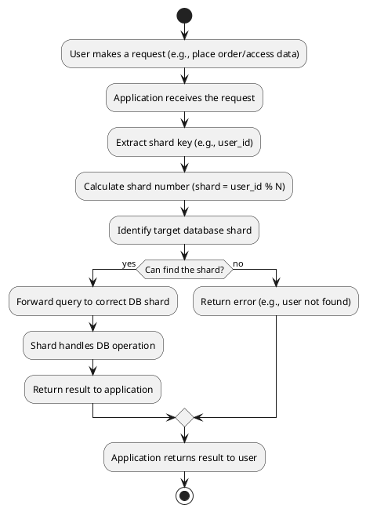

# Database Sharding: Use Case, Implementation, and Reporting

---

## 1. What is Database Sharding?

**Database sharding** is a pattern where a large database is split into smaller, more manageable pieces called **shards**. Each shard holds a subset of the dataset, and sharding is primarily used to improve scalability, performance, and availability.

---

## 2. Use Case: E-Commerce Platform

**Scenario:**
- An e-commerce company with millions of users and products, handling thousands of orders per minute.
- Storing all data in one database leads to performance and maintenance problems as the business grows.

**Sharding Solution:**
- Split the `Orders` table across multiple databases based on `user_id`.
- For example, with 4 shards: each order goes to `orders_shard_N`, where `N = user_id % 4`.

---

## 3. Application - Database Interaction Flow (Horizontal Sharding)

**Textual Flowchart:**

*Copy this into a PlantUML renderer for a graphic!*

---

## 4. Implementation Example

### Create Shard Databases and Tables (MySQL example)
```sql
CREATE DATABASE orders_shard_0;
CREATE DATABASE orders_shard_1;
CREATE DATABASE orders_shard_2;
CREATE DATABASE orders_shard_3;

-- Run this on each shard:
CREATE TABLE Orders (
  order_id BIGINT PRIMARY KEY AUTO_INCREMENT,
  user_id BIGINT NOT NULL,
  product_id BIGINT NOT NULL,
  order_date DATETIME,
  quantity INT,
  amount DECIMAL(10,2)
);
```

### Application Routing Logic (Python Example)
```python
def get_shard_connection(user_id):
    shard_num = user_id % 4
    # Connect to host for orders_shard_{shard_num} ...

def insert_order(user_id, product_id, quantity, amount):
    conn = get_shard_connection(user_id)
    # Insert logic...

def get_orders_for_user(user_id):
    conn = get_shard_connection(user_id)
    # Query logic...
```
- All orders for the same user go to the same shard.

---

## 5. Reporting in Sharded Databases

### a. Per-Shard Reports
- For a single user: Query that user’s shard directly.
- No special challenges.

### b. Global Reports (all users/orders, etc.)
1. Send the same aggregate query to all shards:
    ```sql
    SELECT SUM(amount) FROM Orders;
    ```
2. Collect results from each shard and sum/aggregate in the application.

#### Pseudocode:
```python
totals = []
for shard_num in range(4):
    result = execute_sql_on_shard(shard_num, "SELECT SUM(amount) FROM Orders")
    totals.append(result or 0)
grand_total = sum(totals)
```

#### Table: Reporting Challenges & Solutions

| Challenge                | Solution                                    |
|--------------------------|---------------------------------------------|
| Query all data           | Query all shards; aggregate in code         |
| Slow aggregation         | Use ETL/data warehouse for reporting        |
| Consistency/lag issues   | Accept eventual consistency or use snapshots|
| Complex SQL/joins        | Avoid cross-shard joins, or centralize data |

---

## 6. Common Problems in Sharded Reporting

- **Increased complexity** in coding and operations.
- **Performance overhead** when querying all shards.
- Difficulty with **joins** and **cross-shard** queries.
- **Consistency issues** due to data being updated as reports run.

**Mitigation Techniques:**

- ETL pipelines to aggregate data into a data warehouse (for analytics/reporting).
- Distributed SQL solutions (e.g., Vitess, Citus, CockroachDB).
- Precomputed summary tables/caches.

---

## 7. Summary

**Database sharding** is crucial for high-scale applications to ensure performance and scalability.  
- Simple operations are efficient after sharding.
- Global reporting and analytics require extra engineering, usually involving aggregation across all shards or the use of secondary reporting systems.

*Sharding is optimized for OLTP (transactions); reporting/analytics is most efficient with a supplemental data pipeline or a centralized reporting database.*