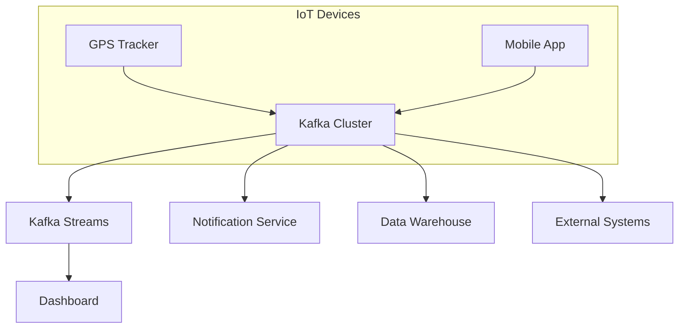

# Kafka, Webhooks, Polling, and Real-Time Notifications: A Conversational Guide

---

## Characters

- **Alex**: Curious learner, asks questions and raises doubts.
- **Sam**: Knowledgeable mentor, explains concepts with examples.

---

### **Scene 1: Introduction to Kafka in Logistics**

**Alex**: I've heard companies use Kafka for fleet tracking and logistics. Can you show me how that works?

**Sam**: Absolutely! Imagine you have trucks sending GPS data. Kafka acts as a central highway for these events. Producers (like GPS trackers) send location updates to Kafka topics, and consumers (like dashboards or alert systems) read those events in real-time.

**Alex**: Can you show me a code example?

**Sam**: Sure! Here’s a simple Python Kafka producer sending GPS events:

```python
from kafka import KafkaProducer
import json, time

producer = KafkaProducer(bootstrap_servers='localhost:9092', value_serializer=lambda v: json.dumps(v).encode('utf-8'))

while True:
    gps_event = {"vehicleId": "TRUCK123", "timestamp": time.strftime('%Y-%m-%dT%H:%M:%SZ', time.gmtime()), "latitude": 27.7, "longitude": 85.3, "speed": 57}
    producer.send("vehicle-location", gps_event)
    time.sleep(5)
```

And a consumer that reads those events:

```python
from kafka import KafkaConsumer
import json

consumer = KafkaConsumer('vehicle-location', bootstrap_servers='localhost:9092', value_deserializer=lambda m: json.loads(m.decode('utf-8')))
for message in consumer:
    print(f"Consumed event: {message.value}")
```

---

### **Scene 2: Architecture and Deployment**

**Alex**: What does the deployment architecture look like?

**Sam**: It’s like this:



---

### **Scene 3: Before Kafka – What Was Used?**

**Alex**: What did people use before Kafka for such systems?

**Sam**: There were several approaches:
- **Message Queues** like RabbitMQ, ActiveMQ
- **Enterprise Service Bus (ESB)** for integrating systems
- **Batch/ETL** for periodic data transfer
- **Database Triggers/CDC** for syncing changes
- **Polling and Webhooks** for notifications

---

### **Scene 4: Polling and Webhooks**

**Alex**: Can you explain polling and webhooks?

**Sam**: Sure!

- **Polling**: The client keeps asking the server for updates at intervals. Simple, but not real-time.
- **Webhooks**: The server calls the client’s API endpoint when an event happens. Real-time, but you must be ready to receive the request.

**Alex**: Can I see code for both?

**Sam**: Here’s a polling example in Python:

```python
import time, requests

API_URL = "https://api.example.com/shipments/TRACK123"
last_status = None
while True:
    response = requests.get(API_URL)
    status = response.json().get("status")
    if status != last_status:
        print(f"Status changed: {status}")
        last_status = status
    time.sleep(60)
```

And a webhook receiver using Flask:

```python
from flask import Flask, request

app = Flask(__name__)
@app.route('/webhook/shipment', methods=['POST'])
def shipment():
    print(f"Received shipment event: {request.json}")
    return {"status": "received"}, 200
```

---

### **Scene 5: Client Notification After Backend Receives Webhook**

**Alex**: If my backend gets a webhook, how does the client (browser/app) get notified?

**Sam**: Excellent question! There are several ways:
- **Polling**: The client keeps checking for updates.
- **WebSockets or SSE**: The backend pushes updates instantly to the client.
- **Push Notifications**: For mobile/web apps.

**Alex**: So after my backend receives a webhook, it should push updates to the client using WebSockets or SSE?

**Sam**: Correct! For example, in Laravel you can use Laravel Echo and Pusher; in .NET, SignalR.

---

### **Scene 6: Secure Webhook Endpoint**

**Alex**: How do I make my webhook endpoint secure?

**Sam**: Good practice includes:
- **Secret Token**: Require a token in the header.
- **HMAC Signature**: Verify a cryptographic signature.
- **IP Whitelisting**: Accept requests only from known IPs.
- **Validate Payload**: Check the data structure.
- **Use HTTPS**: Always encrypt traffic.

**Alex**: Can I see a secure endpoint in .NET?

**Sam**: Absolutely!

```csharp
[ApiController]
[Route("api/webhook")]
public class WebhookController : ControllerBase
{
    [HttpPost("shipment")]
    public IActionResult Shipment([FromBody] ShipmentEvent shipment)
    {
        var token = Request.Headers["X-Webhook-Token"].FirstOrDefault();
        if (token != Environment.GetEnvironmentVariable("WEBHOOK_SECRET"))
            return Forbid();
        // Validate payload and process...
        return Ok(new { status = "received" });
    }
}
```

---

### **Scene 7: Summary Table**

| Concept        | How It Works        | Pros            | Cons                  |
|----------------|--------------------|-----------------|-----------------------|
| Kafka          | Event streaming    | Scalable, replay| Needs infra           |
| Polling        | Client asks server | Easy, universal | Not real-time, wasteful|
| Webhooks       | Server calls client| Real-time, efficient| Needs endpoint security|
| WebSockets/SSE | Server pushes to client | Instant UI update | More setup            |

---

### **Scene 8: Recap and Learning Tips**

**Alex**: Thanks, Sam! This makes it much clearer. So, Kafka is for backend event streaming; polling and webhooks are old and new ways for system notifications; and the best user experience comes when the backend pushes updates to clients in real-time using WebSockets or similar!

**Sam**: Exactly! If you remember the architecture and flow for each, you can design robust, scalable, and secure systems.

---